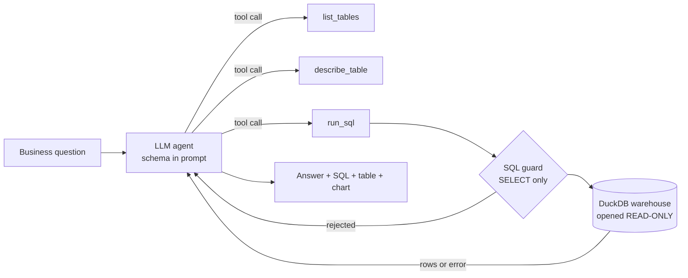

# 🤖 AI Analytics Agent — natural-language questions → SQL → answers

An **LLM agent** that answers business questions in plain English by **exploring a data warehouse, writing its own SQL, running it through safe tools, recovering from errors, and explaining the result**. It runs on a **local model** (Ollama) or **Groq**, is **locked to read-only SELECT queries**, and is **evaluated** against questions with known answers.


It sits on top of the star-schema warehouse from my [**E-commerce Data Pipeline**](https://github.com/Ananya2029/ecommerce-data-pipeline) (Olist, ~100k orders).

## How it works



1. The agent gets the question plus a compact **schema summary** of the warehouse.
2. It calls tools — `list_tables`, `describe_table`, `run_sql` — using standard **function calling** (OpenAI-style tool specs, supported by both Ollama and Groq).
3. If a query fails, the **error message goes back to the agent**, which fixes its SQL and retries (up to 8 model turns).
4. It answers in 1–3 sentences from the query result; the app also shows the SQL, the result table, a chart and every step.

### Safety — defence in depth

An agent that writes SQL must not be able to damage or leak data:

| Layer | What it blocks |
|---|---|
| **Read-only connection** | DuckDB is opened `read_only=True`: writes fail at the database level even if everything else were bypassed |
| **SQL guard** | only a single `SELECT` / `WITH` statement; rejects `DROP`, `DELETE`, `UPDATE`, `COPY`, `ATTACH`, `INSTALL`, `PRAGMA`, file readers (`read_csv`…), and stacked statements (`SELECT 1; DROP …`) — while still allowing those words inside string literals |
| **Limits** | at most 50 result rows go back to the model; queries are interrupted after 20 s |

These are covered by tests (`tests/test_tools.py`), including a check that a `DELETE` fails even without the guard.

## Evaluation

`eval/questions.json` holds **18 business questions** with expected answers computed by hand-written "gold" SQL (e.g. *"What percentage of delivered orders arrived late?"*, *"What share of revenue comes from the top 10 sellers?"*). An answer is correct if the expected value appears in the agent's final query result or its text (numbers within 1%).

### Local 3B model (qwen2.5:3b on a laptop CPU)

| | v1 agent | **v2 agent** |
|---|---|---|
| **Correct answers** | 28% (5/18) | **44%** (8/18, in each of two runs) |
| Questions hitting an SQL error | 10 | **4** |
| Median time per question | 25 s | **19 s** |

**What the v1 run revealed, and what v2 changed:**

- **The model narrated instead of acting.** It often wrote *"Let's correct the query and run it again"* — and stopped. v2 detects a reply with no successful query (or right after an error) and **sends the agent back to its tools**.
- **It guessed column names** (`purchase_date`, `fact_order`). v2 puts a **compact schema summary in the system prompt**, which is standard text-to-SQL practice.
- **Runaway generations** hit the timeout; v2 caps the output length.

**What is still wrong** — typical of a 3-billion-parameter model: counting the wrong entity (customers instead of sellers), adding filters nobody asked for (e.g. *on-time only*), integer division in percentages, and wrong `GROUP BY`s. Both v2 runs scored 8/18, but not on exactly the same questions (small models on CPU are not perfectly deterministic even at temperature 0).

**Evaluation fixes, disclosed:** after the first v2 run, expected values were switched from rounded to full precision (a correct *3.55* was being compared with a rounded *3.6*), and one question was reworded to *"…placed an order (of any status)"* because it contradicted the agent's documented default of excluding canceled orders.

**Next step:** the same harness runs with a larger model by setting `LLM_PROVIDER=groq` (Llama 3.3 70B); the agent code does not change. The v1 and v2 results are in `reports/`.

## Run it

```bash
pip install -r requirements.txt
cp .env.example .env                 # choose ollama or groq; set WAREHOUSE_PATH if needed

# the warehouse comes from the ecommerce-data-pipeline project:
#   python -m pipeline.run   (in that repo)  -> warehouse/olist.duckdb

python -m agent.core "Which 5 product categories earned the most revenue?"
streamlit run app/app.py             # chat UI with SQL, table, chart and agent steps
python -m agent.evaluate             # evaluation (needs the LLM)
python -m pytest -q                  # tests: SQL guard, read-only warehouse, agent loop (LLM stubbed)
```

## Project structure

```text
├── agent/
│   ├── core.py       # agent loop: schema-aware prompt, tool calls, error recovery, nudges
│   ├── tools.py      # list_tables / describe_table / run_sql + SQL guard + read-only warehouse
│   ├── llm.py        # Ollama / Groq tool calling, swappable via .env
│   ├── evaluate.py   # accuracy, tool calls, SQL errors, latency
│   └── config.py
├── app/app.py        # Streamlit chat: answer, SQL, table, chart, agent steps
├── eval/questions.json
├── reports/          # v1 and v2 evaluation results
└── tests/            # 17 tests, no LLM needed
```

## Tech stack

Python · LLM tool calling · Ollama (qwen2.5) · Groq API · DuckDB · SQL · pandas · Streamlit · Plotly · pytest · GitHub Actions
